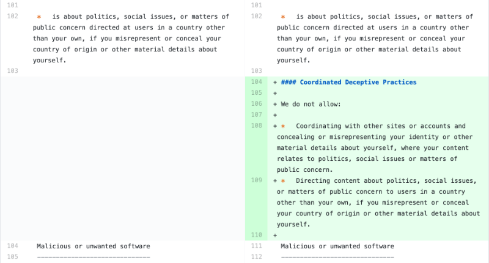
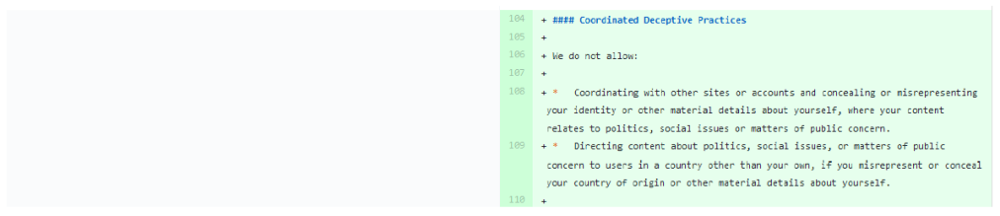

# Suivi des CGUs



## Les services en ligne ont des conditions générales qui évoluent dans le temps. CGUs permet aux défenseurs des droits des utilisateurs, aux régulateurs et à toute personne intéressée de suivre les évolutions de ces conditions générales en étant notifiée à chaque publication d'une nouvelle version, et en explorant leur historique.

### Contexte et enjeux

Tout service numérique dispose de conditions générales d’utilisation. Ces conditions sont définies dans un ensemble de documents contractuels qui régissent les modalités d’interaction entre le fournisseur du service et ses utilisateurs. Les aspects spécifiés peuvent être les politiques de modération des contenus, la responsabilité de l'éditeur ou encore la juridiction compétente en cas de litige.

En matière de manipulation de l'information, les pratiques décrites dans les conditions permettent de mieux appréhender les vulnérabilités de ces acteurs. Par ailleurs, la transcription, dans ces conditions, des contraintes législatives, des recommandations des pouvoir publics ou encore des mesures volontaires visant à lutter contre les manipulations de l’information permet d’apprécier leur loyauté.

Ces constats démontrent l’importance du suivi des engagements des plateformes et des règles de comportement qu'elles édictent en matière de lutte contre les manipulations de l’information, afin de définir des politiques publiques appropriées, d'en mesurer l'impact mais également de préfigurer une régulation de la fonction de modération des plateformes au regard de leurs conditions d’utilisation.

Ainsi, l’outil développé permet de suivre les évolutions des conditions générales des principaux fournisseurs de services en ligne en :
- recevant des notifications en temps réel de chaque publication d'une nouvelle version des
documents ; 
- affichant spécifiquement les changements appliqués aux documents ;
- disposant d’un corpus documentaire de leur historique.

### Études de cas

Google a modifié les conditions de validation des applications mobiles publiées sur son Play Store le 12 août 2020 afin d’interdire les apps qui laissent supposer à tort être une
application officielle et ne mentionnent pas l’existence d’une relation avec une autre entité. Cette nouvelle version des conditions interdit également les apps de développeurs qui témoignent à tort d’un lien avec une autre société ou un autre développeur. Ces mesures
ferment ainsi certaines vulnérabilités exploitées pour la manipulation de l’information.

Google AdSense a modifié sa politique d’utilisation le 03 septembre 2020 afin d’y inclure
une mention relative aux pratiques trompeuses coordonnées. Celle-ci prohibe les pratiques
visant à se coordonner avec d’autres sites ou comptes en dissimulant ou déformant des
informations relatives à son identité lorsque le contenu est lié à des enjeux politiques, sociaux ou d’intérêt public et le fait de cibler un contenu lié à des enjeux politiques, sociaux ou d’intérêt public auprès d’utilisateurs émanant d’un pays qui n’est pas le sien tout en altérant ou en dissimulant des informations relatives à son pays d’origine.

TikTok a modifié ses directives relatives aux organismes d'application de la loi le 18 août
2020 pour ajouter un lien vers un formulaire de demande d’accès aux données à destination
des autorités. Une nouvelle version, en date du 08 septembre 2020, a modifié le lien
permettant d’accéder à ce formulaire.

### Fonctionnement

Les services sont déclarés dans l'outil CGUs grâce à un fichier de déclaration listant les documents qui forment l'ensemble des conditions régissant l'usage du service. Ces documents peuvent être de plusieurs types : « conditions d'utilisation », « politique de confidentialité », « contrat de développeur »…

Afin de suivre leurs évolutions, les documents sont régulièrement mis à jour, en les téléchargeant depuis une adresse web et en sélectionnant leur contenu dans la page web pour supprimer le bruit (publicités, menus de navigation, champs de connexion…). En plus de simplement sélectionner une zone de la page, certains documents possèdent du bruit supplémentaire (hashs dans des liens, jetons CSRF...) créant de faux positifs en terme d'évolutions. En conséquence, CGUs supporte des filtres spécifiques pour chaque document.

Néanmoins, le bruit peut changer de forme avec le temps. Afin d'éviter des pertes d'information irrécupérables pendant l'étape de filtrage du bruit, un instantané de la page Web est enregistré à chaque évolution. Après avoir filtré l'instantané de son bruit, si le document résultant a changé par rapport à sa version précédente, une nouvelle version est enregistrée.

Vous pouvez disposer de votre propre instance privée de l'outil CGUs et suivre vous-même les évolutions. Néanmoins, nous publions chaque version sur une instance publique facilitant l'exploration de l'historique et notifiant par courriels l'enregistrement de nouvelles versions. Les utilisateurs peuvent s'abonner aux notifications.

Note: Actuellement, nous ne suivons que les conditions rédigées en anglais et concernant la juridiction européenne.

### Parties prenantes

L’outil est construit sous la forme d’un logiciel libre et collaboratif, ce qui signifie que toute entité peut contribuer à son amélioration et à l’ajout de documents et de fournisseurs de services à suivre.

Direction Générale des Entreprises  
: La Direction générale des entreprises (DGE) et plus particulièrement le pôle d’expertise de la régulation du numérique (PEReN) contribue d’ores et déjà dans le cadre de son suivi des magasins d’applications mobiles, ce qui a permis de développer de nouvelles fonctionnalités comme le suivi des images et des documents au format PDF.

Autorité de la concurrence  
: Lorem ipsum dolor sit amet, consectetur adipiscing elit ut aliquam, purus sit amet luctus venenatis, lectus magna fringilla urna, porttitor rhoncus dolor purus non enim

ToSDR  
: L’association Terms of Service Didn’t Read (ToSDR) va transférer ses moyens de suivi vers
notre outil et contribuer ainsi les documents dont elle dispose. Actuellement, 51 fournisseurs de service en ligne et 137 documents associés sont suivis. Les contributions de ToSDR laissent espérer une multiplication par dix du nombre de documents suivis.

